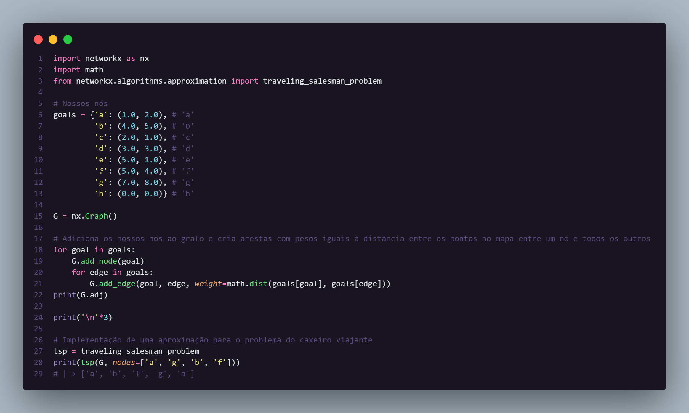
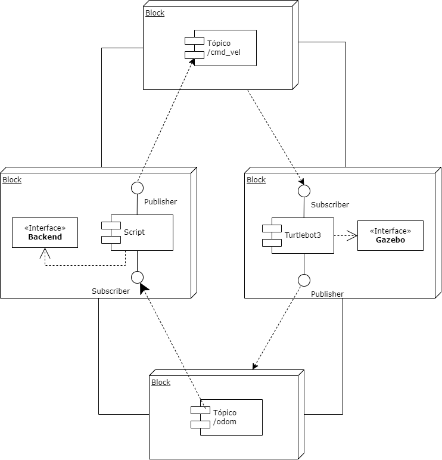
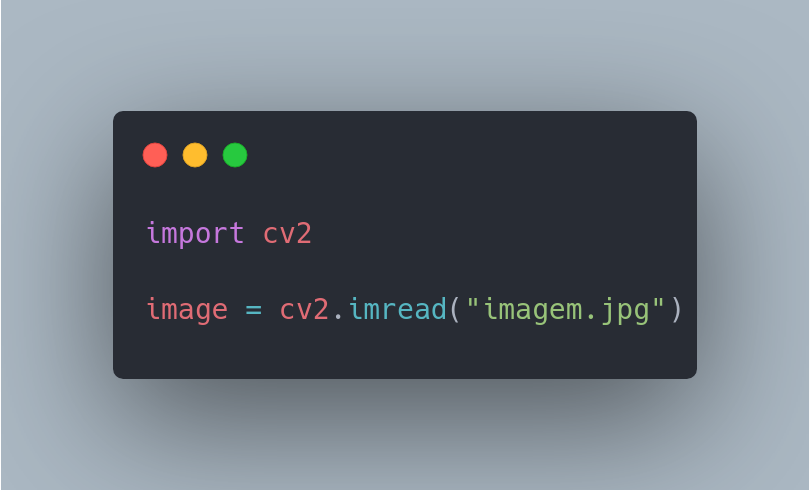
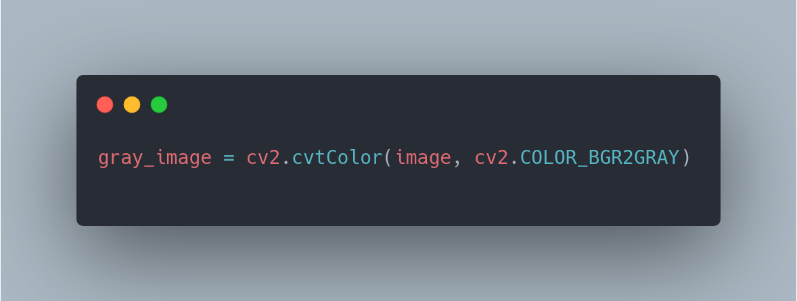
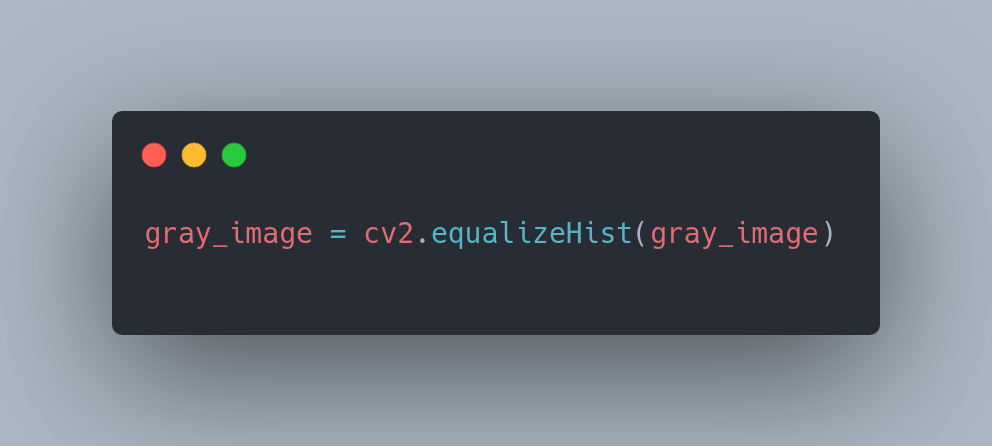
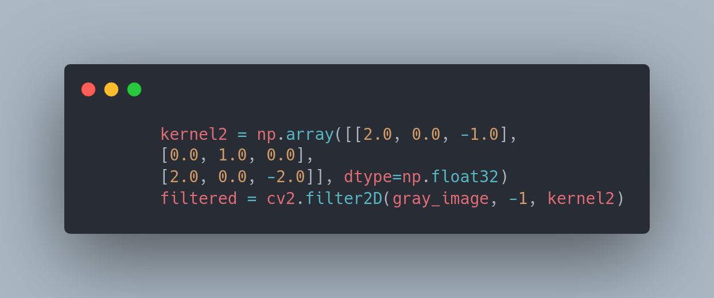

<table>
<tr>
<td>
<a href= "https://www2.gerdau.com.br/"></a>
</td>
<td><a href= "https://www.inteli.edu.br/"></a>
</td>
</tr>
</table>

# Sumário

- [](#)
- [Sumário](#sumário)
- [1. Entendimento de negócio](#1-entendimento-de-negócio)
  - [1.1. Análise setorial](#11-análise-setorial)
  - [1.2. Análise empresarial](#12-análise-empresarial)
  - [1.3 Análise financeira](#13-análise-financeira)
  - [1.4. Análise do time de desenvolvimento](#14-análise-do-time-de-desenvolvimento)
      - [Matriz de riscos](#matriz-de-riscos)
  - [1.5. Análise da solução](#15-análise-da-solução)
- [Outrossim, há uma interface gráfica que tem como objetivo ajudar no planejamento para as inspeções e manutenções desses ambientes confinados. Essa interface gráfica possuirá dashboards que se atualizam em tempo real e, também, fotos do interior do ambiente confinado que serão captadas pela câmera que o protótipo está equipado.](#outrossim-há-uma-interface-gráfica-que-tem-como-objetivo-ajudar-no-planejamento-para-as-inspeções-e-manutenções-desses-ambientes-confinados-essa-interface-gráfica-possuirá-dashboards-que-se-atualizam-em-tempo-real-e-também-fotos-do-interior-do-ambiente-confinado-que-serão-captadas-pela-câmera-que-o-protótipo-está-equipado)
- [Conteúdo](#conteúdo)
- [1. Entendimento de negócio](#1-entendimento-de-negócio-1)
  - [1.1. Análise setorial](#11-análise-setorial-1)
  - [1.2. Análise empresarial](#12-análise-empresarial-1)
  - [1.3. Análise do time de desenvolvimento](#13-análise-do-time-de-desenvolvimento)
- [(Matriz de Riscos)](#matriz-de-riscos-1)
  - [1.4. Análise da solução](#14-análise-da-solução)
- [2. Entendimento do metadesign](#2-entendimento-do-metadesign)
  - [2.1. Fatores mercadológicos](#21-fatores-mercadológicos)
      - [Relação entre o produto desenvolvido e sua precificação com o merdaco atual](#relação-entre-o-produto-desenvolvido-e-sua-precificação-com-o-merdaco-atual)
      - [Precificação](#precificação)
    - [Cenário do mercado.](#cenário-do-mercado)
  - [2.2. Sistema produto/design](#22-sistema-produtodesign)
      - [Missão do projeto proposto](#missão-do-projeto-proposto)
      - [Unidade formal entre design, divulgação e venda](#unidade-formal-entre-design-divulgação-e-venda)
  - [2.3. Sustentabilidade ambiental](#23-sustentabilidade-ambiental)
      - [Ecoeficiência ambiental proposta pelo projeto](#ecoeficiência-ambiental-proposta-pelo-projeto)
  - [2.4. Influências socioculturais](#24-influências-socioculturais)
  - [2.5. Tipológico-formais e ergonômicos](#25-tipológico-formais-e-ergonômicos)
  - [2.6. Tecnologia produtiva e materiais empregados](#26-tecnologia-produtiva-e-materiais-empregados)
  - [2.7. Entendimento da experiência do usuário](#27-entendimento-da-experiência-do-usuário)
    - [Persona](#persona)
    - [User Story](#user-story)
- [3. Arquitetura do sistema](#3-arquitetura-do-sistema)
    - [V1](#v1)
    - [V2](#v2)
  - [3.1 Engenharia de requisitos](#31-engenharia-de-requisitos)
    - [Requisitos Funcionais](#requisitos-funcionais)
    - [Requisitos Não Funcionais](#requisitos-não-funcionais)
  - [3.2 Viabilidade](#32-viabilidade)
- [4. Sistema de locomoção e otimização de rota](#4-sistema-de-locomoção-e-otimização-de-rota)
  - [4.1 Sistema de locomoção](#41-sistema-de-locomoção)
  - [4.2 Otimização de rota](#42-otimização-de-rota)
    - [4.2.1 Problema “O caixeiro viajante”](#421-problema-o-caixeiro-viajante)
    - [4.2.2 Implementação](#422-implementação)
    - [5.1.1 Instalação do ambiente de simulação](#511-instalação-do-ambiente-de-simulação)
      - [5.1.1.1 Ros Humble Turtlebot3](#5111-ros-humble-turtlebot3)
    - [5.1.2 Comunicação](#512-comunicação)
- [6. Interface de usuário](#6-interface-de-usuário)
  - [6.1. Visão geral do design](#61-visão-geral-do-design)
      - [Palheta de cores](#palheta-de-cores)
      - [Tipografia](#tipografia)
      - [Ícones](#ícones)
  - [6.2. Telas](#62-telas)
      - [Tela inicial](#tela-inicial)
      - [Tela principal](#tela-principal)
      - [Setup](#setup)
      - [Criar](#criar)
      - [Editar](#editar)
      - [Rodando](#rodando)
- [7. Sistema de visão computacional](#7-sistema-de-visão-computacional)
  - [7.1 Pipeline de Pré-processamento de Imagem](#71-pipeline-de-pré-processamento-de-imagem)
    - [Carregamento da imagem](#carregamento-da-imagem)
    - [Conversão de cores](#conversão-de-cores)
    - [Correção de iluminação](#correção-de-iluminação)
    - [Filtro para extração de características](#filtro-para-extração-de-características)
  - [7.2 Escolha do modele de predição](#72-escolha-do-modele-de-predição)
  - [7.3 Validação do sistema de visão computacional](#73-validação-do-sistema-de-visão-computacional)
      - [Testes de Eficácia](#testes-de-eficácia)
- [8. Sistemas de segurança](#8-sistemas-de-segurança)
  - [8.1 Definição, implementação e validação de um sistema de tomada de decisões a partir da detecção de um obstáculo.](#81-definição-implementação-e-validação-de-um-sistema-de-tomada-de-decisões-a-partir-da-detecção-de-um-obstáculo)
  - [8.2 Mapeamento de riscos dos sistemas eletromecânicos, mecânicos e eletrônicos.](#82-mapeamento-de-riscos-dos-sistemas-eletromecânicos-mecânicos-e-eletrônicos)
  - [8.3 Definição, implementação e validação de dispositivos de segurança para os riscos mapeados.](#83-definição-implementação-e-validação-de-dispositivos-de-segurança-para-os-riscos-mapeados)
  - [8.4 Implementação e validação de sistemas de proteção contra comandos indevidos.](#84-implementação-e-validação-de-sistemas-de-proteção-contra-comandos-indevidos)
- [9. Backend](#9-backend)
- [10. Integração de sistemas](#10-integração-de-sistemas)
- [11. Validação da eficácia do sistema](#11-validação-da-eficácia-do-sistema)
- [12. Referências](#12-referências)
- [12. Material de apoio](#12-material-de-apoio)
- [13. Anexos](#13-anexos)
- [Apresentação Sprint 03](#apresentação-sprint-03)
  - [2.2. Sistema produto/design](#22-sistema-produtodesign-1)
  - [2.3. Sustentabilidade ambiental](#23-sustentabilidade-ambiental-1)
  - [2.4. Influências socioculturais](#24-influências-socioculturais-1)
  - [2.5. Tipológico-formais e ergonômicos](#25-tipológico-formais-e-ergonômicos-1)
- [\<\<\<\<\<\<\< HEAD](#-head)
  - [2.6. Tecnologia produtiva e materiais empregados](#26-tecnologia-produtiva-e-materiais-empregados-1)
- [3. Descrição da arquitetura do sistema.](#3-descrição-da-arquitetura-do-sistema)
- [\<\<\<\<\<\<\< HEAD](#-head-1)
  - [3.1  Engenharia de requisitos](#31--engenharia-de-requisitos)
    - [Requisitos Funcionais](#requisitos-funcionais-1)
    - [Requisitos Não Funcionais](#requisitos-não-funcionais-1)
- [4. Sistema de locomoção e otimização de rota.](#4-sistema-de-locomoção-e-otimização-de-rota-1)
- [5. Interface de usuário.](#5-interface-de-usuário)
- [6. Sistema de visão computacional.](#6-sistema-de-visão-computacional)
- [7. Sistemas de segurança.](#7-sistemas-de-segurança)
- [8. Backend.](#8-backend)
- [9. Integração de sistemas.](#9-integração-de-sistemas)
- [10.  Validação da eficácia do sistema.](#10--validação-da-eficácia-do-sistema)
- [10.  Validação da eficácia do sistema.](#10--validação-da-eficácia-do-sistema-1)
- [11. Referências](#11-referências)

# 1. Entendimento de negócio

## 1.1. Análise setorial

<p>Inicialmente, a empresa enfrentava desafios em relação à segurança, com riscos para a saúde e segurança de seus colaboradores. Sem a nossa solução, a Gerdau teria que continuar a lidar com os riscos e consequências negativas, como afastamentos, lesões, doenças, entre outros fatores que infelizmente estão sujeitos.</p>
<p>Nossa solução é uma forma de reduzir os riscos e garantir a segurança dos funcionários em espaços confinados. Isso envolve a implementação de novas tecnologias. Com a proposta da Safe McQueen, a Gerdau pode agora evitar riscos potenciais à saúde e ao bem-estar de seus funcionários. Por isso, nossa Matriz Oceano Azul é uma relação de fatores da empresa Gerdau atual, e a perspectiva após a solução implementada.</P>

<p align="center"></p>
<ul>
  <li><b>Reduzir</b></li>
  Inovação: Reduzir a necessidade de equipamentos ou processos obsoletos no processo.<br>
  Segurança: Reduzir riscos e situações de perigo que os colaboradores enfrentam 
  
  <li><b>Eliminar</b></li>
  Sustentabilidade: Eliminar o uso de materiais prejudiciais ao meio ambiente na solução, utilizando materiais sustentáveis e com baixo impacto ambiental.
  
  <li><b>Aumentar</b></li>
  Tecnologia: Oferecer uma solução com tecnologia de ponta que facilite o trabalho dos funcionários.<br>
  Segurança: Aumentar a eficiência da solução no que se refere à segurança dos funcionários em espaços confinados.<br>
  Custos: Pode haver um aumento no custo inicial de implementação, porém, a longo prazo, a empresa terá redução de riscos e pode trazer benefícios para a imagem da empresa e, consequentemente, suas receitas.<br>
  Qualidade: A qualidade do serviço pode não aumentar. Todavia, a qualidade da experiência do funcionário pode ser aumentada, já que eles terão mais confiança e segurança em seu trabalho.
  
  
  <li><b>Criar</b></li>
  Perenidade: Criar uma solução que seja durável e de fácil manutenção.<br>
  Conforto: Criar um ambiente de trabalho mais confortável para os funcionários que precisam trabalhar em espaços confinados. Já que a segurança em ambientes confinados pode ser uma fonte de estresse e desconforto. Além de demonstrar a preocupação da empresa quanto a saúde deles.<br>
  Tecnologia: Com esse protótipo inicial é possível criar tecnologias mais avançadas; sistemas de monitoramento, sensores, até realidade virtual, o que pode ser visto como um diferencial tecnológico em relação à concorrência
</ul>

## 1.2. Análise empresarial

(Matriz SWOT)

## 1.3 Análise financeira

A análise financeira de um projeto visa mostrar a um parceiro de negócios que sua implementação é viável do ponto de vista financeiro, complementando a precificação. Nesse contexto, a mitigação do risco de acidentes no ambiente de trabalho foi considerada a forma de viabilizar o projeto. Com isso, os funcionários estariam mais protegidos em relação à entrada em ambientes confinados, o que reduziria o risco de acidentes e, consequentemente, os custos associados, como despesas médicas, indenizações, reparação de danos e perda de produtividade. Além disso, os custos indiretos, como danos à reputação e perda de negócios, também seriam minimizados.
Os acidentes no ambiente de trabalho não geram apenas custos financeiros diretos e indiretos, mas também podem ter um impacto negativo na moral e produtividade dos funcionários. Somado ao fato de que os funcionários podem precisar lidar com a interrupção do trabalho enquanto o acidente é investigado e resolvido, o que pode levar à perda de produtividade.
Em contrapartida, a implementação de políticas de segurança eficazes pode ter um impacto positivo na moral e produtividade dos funcionários. Ademais, uma cultura de segurança positiva pode levar a uma maior colaboração e comunicação entre os funcionários, o que pode melhorar a eficiência e a qualidade do trabalho. Portanto, investir em medidas preventivas e políticas de segurança eficazes é uma forma de proteger os funcionários, reduzir os custos associados a acidentes no ambiente de trabalho e melhorar a moral e produtividade da equipe. Dessa forma, é possível garantir a saúde e segurança dos funcionários e evitar custos desnecessários para a empresa, tornando a implementação do projeto financeiramente viável e positiva para todos os envolvidos.
Foi realizada uma pesquisa com o objetivo de coletar informações quantitativas sobre os custos dos acidentes de trabalho, a fim de embasar a abordagem proposta na análise financeira. O grupo teve como prioridade os dados relacionados aos acidentes sofridos pelos funcionários da empresa, incluindo desde casos leves até os mais graves. Além disso, foram levantadas informações sobre as multas decorrentes da emissão de gases durante o processo de fundição do aço, que é a principal atividade realizada pela Gerdau. Com base nas pesquisas realizadas na internet, foi elaborada uma planilha de preços que mostra o custo de alguns acidentes que poderiam ser evitados pela empresa ao adotar soluções preventivas.

</img>
fontes: Indenização por acidente de trabalho: valor, requisitos e como receber (2023):
https://mdn.adv.br/indenizacao-por-acidente-de-trabalho/#:~:text=Para%20a%20CLT%2C%20o%20valor,com%20a%20gravidade%20da%20situa%C3%A7%C3%A3o.

Tabelas de Preços de Referência para Cálculo de Multas Ambientais divulgadas pela Companhia Ambiental do Estado de São Paulo (Cetesb) em 2021:
(https://cetesb.sp.gov.br/legislacao-e-normas/).

## 1.4. Análise do time de desenvolvimento

#### Matriz de riscos

Uma matriz de riscos é uma ferramenta utilizada para avaliar e gerenciar os riscos e oportunidades envolvidos em um projeto, atividade ou processo. Ela ajuda a identificar e avaliar os potenciais riscos e a probabilidade de sua ocorrência, bem como o impacto que eles podem exercer sobre o projeto ou atividade. A matriz também pode ajudar a definir a prioridade das ações correspondentes ao gerenciamento do projeto, indicando quais riscos devem ser tratados com maior urgência, por exemplo. Além disso, no projeto em questão, a criação da matriz visa apresentar ao parceiro o que a equipe imagina enfrentar e pensar em conjunto em maneiras de mitigar os riscos, bem como aproveitar as oportunidades existentes.
</img>

## 1.5. Análise da solução

<p align="center"></p>
Nossa proposta de valor consiste em uma solução que contempla os seguintes serviços: 
<ul>
  <li> Simulação do trajeto de um robô seguidor e seus dados de sensores para medição atmosférica</li>
  <li> Interface gráfica com um dashboard interativo para os dados captados </li>
  <li> Protótipo de robô seguidor focado no funcionamento dos sensores </li>
</ul>
Essa solução consegue mitigar as principais dores do cliente: a segurança do operador que realiza a manutenção e a dificuldade em avaliar se há riscos ao colaborador sem entrar no ambiente confinado. Essas dores são sanadas graças aos sensores que identificam a presença e a quantidade de componentes gasosos tóxicos, inflamáveis e seu nível de perigo no local; além do fato de que o protótipo verificará o ambiente primeiro, perdendo a necessidade de um colaborador se arriscar dentro dos ambientes confinados.

Outrossim, há uma interface gráfica que tem como objetivo ajudar no planejamento para as inspeções e manutenções desses ambientes confinados. Essa interface gráfica possuirá dashboards que se atualizam em tempo real e, também, fotos do interior do ambiente confinado que serão captadas pela câmera que o protótipo está equipado.
=======
# Conteúdo
- [Manuais](#manuais)
  - [Manual de Implantação](#manual-de-implantação)
  - [Manual do Usuário](#manual-do-usuário)
- [Referências](#referências)

# 1. Entendimento de negócio


## 1.1. Análise setorial
(Oceano azul)

## 1.2. Análise empresarial
(Matriz SWOT)

## 1.3. Análise do time de desenvolvimento
<<<<<<< HEAD
(Matriz de Riscos)
=======

>>>>>>> 459302da6c94ef64552e2298946b56d66afbf90a

## 1.4. Análise da solução
(Proposta de valor)
>>>>>>> Stashed changes

# 2. Entendimento do metadesign

## 2.1. Fatores mercadológicos
<<<<<<< Updated upstream

#### Relação entre o produto desenvolvido e sua precificação com o merdaco atual

O produto será desenvolvido com a principal função de simular virtualmente a movimentação de um robô que, por sua vez, irá estar em um espaço confinado com objetivo primordial de captar informações sobre o ambiente atmosférico. Atualmente, a Confederação Nacional da Indústria (CNI) realizou um estudo para mapear os principais níveis de automação industrial do Brasil, aproximadamente 19% das indústrias já possuem sistemas integrados de engenharia, aumentando, portanto, sua produtividade e garantindo a segurança humana em trabalhos com altos riscos. Em 2022, foram contabilizados três milhões de robôs operando em indústrias em todo o mundo, ao total foram mais de US$ 13,2 bilhões investidos nos últimos anos para a instalação desses projetos robóticos. Especificamente, com o robô a ser utilizado para a solução descrita acima, não irá ultrapassar US$ 1000, é notório, portanto, que o valor investido não é exageradamente elevado, visto que, hoje tem robôs no mercado que custam mais milhões de dólares.

#### Precificação

O processo de precificação acontece com o objetivo primordial de levantar os dados financeiros sobre os serviços necessários para a implementação da solução, de modo que, seja visível o preço dos materiais utilizados, por exemplo: o modelo do robô, taxa de importação, os sensores atmosféricos a serem utilizados, a câmera, etc , as ferramentas digitais usadas no desenvolvimento do projeto que podem incluir algum gasto, por exemplo: o uso do figma e canva pro , o valor que será necessário para o treinamento dos funcionários para terem uma adaptação melhor com o sistema, e se tiver, acrescentar à soma outros fatores que necessitem investimentos para a implementação da solução ocorrer de maneira qualitativamente satisfatória.

### Cenário do mercado.

A indústria mundial da produção de aço, por séculos, tem se valorizado pela produção de um material resistente e durável, ganhando um importante espaço no avanço da sociedade, permitindo-nos construir pontes, ferrovias, navios e arranha-céus. Com a demanda crescente de aço, o setor consolidou um histórico de aumentos em sua capacidade, volume e valor.
O aço é importante pelas indústrias que fazem seu uso. Ele está presente na construção civil, na industria automobilística, nas forças armadas e em demais setores. O produto processado é usado na criação de diversos produtos do cotiano, como geladeiras, máquinas de lavar, trens e bisturis cirúrgicos.
Há uma preocupação relativa ao aspecto ecológico por parte da indústria, que tem explorado significativamente o conceito de aço verde – alternativa inovadora constituída pela fabricação de aço sem a necessidade do uso de combustíveis fósseis e pelo uso efetivo da sucata de metal. Dentre outras inovações dessa área, destaca-se o aumento da automatização de processos, com o uso de AGVs em tarefas de risco, diminuindo o erro humano em acidentes ecológicos.
O mercado nacional contou com um forte crescimento durante a pandemia de Covid-19, fazendo contra ponto ao setor nesse mesmo período. “Apesar da montanha-russa que foi 2022, foi um bom ano para o setor. Tanto que, em termos de vendas internas, este foi o quarto melhor da década”, resumiu o presidente-executivo do Aço Brasil, Marco Polo de Mello Lopes. Atualmente a área já não está mais em constante crescimento, apresentando um recuo em sua produção, que em fevereiro fechou em 2,5 milhões de toneladas, representando uma queda de 4,9%.

## 2.2. Sistema produto/design

#### Missão do projeto proposto

O propósito do projeto elaborado para a Gerdau relaciona-se à crescente atenção da empresa aos aspectos de segurança que envolvem seus funcionários e colaboradores. Sabendo-se que um desejo da instituição é evitar a exposição ao risco nos espaços confinados com os quais a Gerdau trabalha, evidencia-se o desafio de projetar uma solução capaz de informar, de maneira precisa, as condições atmosféricas do espaço a ser inspecionado. A missão do projeto está diretamente relacionada à visão institucional da Gerdau, que tem como princípios a valorização da segurança e inovação.

#### Unidade formal entre design, divulgação e venda

A princípio, será concebida uma simulação virtual do veículo autônomo guiado atuando sobre um espaço confinado genérico. Desse modo, será possível estudar a viabilidade da construção de um protótipo físico que atenda aos requisitos da empresa. É ideal que o protótipo seja capaz de reproduzir os resultados obtidos por meio da simulação. Além disso, é de fundamental importância que o protótipo seja escalável — requisito imperativo para a implementação do produto por parte do cliente. O produto desenvolvido, portanto, será apresentado ao mercado como ferramenta de apoio à manutenção da segurança do trabalho, cumprindo o papel de inspecionar de forma eficaz os ambientes confinados que ofereçam potenciais riscos em casos de intervenção humana. Espera-se tornar evidente a qualidade do produto por meio de demonstrações de seu funcionamento, desde sua configuração no ambiente industrial em que será utilizado até a geração do relatório referente à inspeção feita. Os diferenciais da solução, como a possibilidade de análise de imagens computacionais e controle do veículo via interface, também serão destacados. Será imprescindível, por fim, tratar de maneira transparente o processo de produção do veículo, evidenciando os aspectos que funcionam e os pontos de melhoria para implementação futura.

## 2.3. Sustentabilidade ambiental

#### Ecoeficiência ambiental proposta pelo projeto

O projeto em parceria com a Gerdau tem como objetivo alcançar a ecoeficiência de forma indireta, evitando impactos ambientais prejudiciais ao entorno da instalação da Gerdau. Uma das soluções propostas é o uso de Veículos Autônomos Guiados (AGVs) para monitorar regularmente as tubulações de gás e prevenir possíveis acidentes que possam contaminar o meio ambiente e afetar a saúde humana. Além disso, o uso de energia elétrica em vez de combustíveis fósseis torna essa solução ainda mais vantajosa para o meio ambiente.

O grupo também propôs uma solução visando ser mais ecoeficiente, que poderia ser aplicada em um projeto com fins lucrativos em parceria com a Gerdau. Em vez de vender diretamente um robô fabricado para o parceiro de negócio, a solução seria oferecer o robô como serviço de assinatura. Dessa forma, o parceiro ainda veria vantagens econômicas em contratar o serviço, já que o manteria sempre atualizado e contaria com o suporte mais assertivo, enquanto o grupo reduziria o uso de recursos naturais ao evitar a compra de mais um robô. Em resumo, o uso de veículos autônomos não apenas contribui para a ecoeficiência e a redução de danos ambientais, mas também torna os procedimentos de inspeção mais eficientes e seguros.

## 2.4. Influências socioculturais

## 2.5. Tipológico-formais e ergonômicos

## 2.6. Tecnologia produtiva e materiais empregados

## 2.7. Entendimento da experiência do usuário

### Persona

<p align="center"></img></p>
A persona foi criada para ajudar a entender as necessidades e os desejos do público alvo para a solução de automação industrial que foi apresentada, ela é um personagem fictício, doravante, com informações reais fornecidas pelos representantes da Gerdau. Nesse caso, especificamente,  Joana é técnica em segurança do trabalho, realiza atividades de alto risco, e, portanto, está sempre com equipamentos de proteção individual, sobretudo, por serem ainda atividades arriscadas, compreende que é um trabalho bastante delicado. Com a implementação da solução em desenvolvimento , Joana teria que aprender a supervisionar o trabalho do robô, deixando para ele concluir a etapa mais perigosa e garantindo que seu desempenho nas demais responsabilidades do processo de inspeção do ambiente confinado estivessem ocorrendo de forma correta.

### User Story

# 3. Arquitetura do sistema

### V1

<p align="center"></img></p>

Atualmente nossa arquitetura pode ser dividia em 2 partes:
A primeira envolve todo o sistema que controla o robo e seus periféricos, esse parte lida com a comunicação entre os componentes e a simulação do robo, essa parte é feita utilizando o ROS2, que é um framework de robótica que permite a comunicação entre os componentes do sistema, além disso ele também permite a simulação do robo, o que facilita o desenvolvimento do sistema, pois não é necessário ter um robo fisico para testar o sistema. A segunda parte é uma solução web que permite a visualização dos dados coletados pelo robo, essa parte é feita utilizando o React, que é um framework de desenvolvimento web, flask que é um framework de desenvolvimento web para python e sqlite.

### V2

<p align="center"></img></p>

Atualizamos nossa arquitetura para levar em conta que o robô não terá acesso a internet de forma constante por isso precisamos de um banco de dados embarcado para armazenar os dados coletados pelo robô, além disso agora o robo só manda dara os dados para o bancos de dados ao final da rota. Além disso estamos considerando usar uma bridge entre o ros2 e a websocket para que o robo possa mandar os dados para a aplicação web.

## 3.1 Engenharia de requisitos

A engenharia de requisitos tem como objetivo promover em frases curtas e objetivas funcionalidades e características específicas do sistema, assim, atendendo as necessidades e expectativas do usuário, cumprir as especificações técnicas, a conformidades com as regulamentações e o padrão de qualidade aplicável em cada etapa do projeto.

### Requisitos Funcionais

Tem como objetivo primordial descrever as principais funcionalidades e características específicas da interação do sistema robótico. Como: a configuração do intervalo de distância entre os pontos de medição, a transmissão das informações para o relatório e o armazenamento dos dados atmosféricos por meio de sensores.

1. Anteriormente ao processo de entrada aos espaços confinados, o robô será configurado para a definição do intervalo de distância entre os pontos da medição.

2. Após a concretização das medições, o robô enviar as informações para o relatório que poderá ser acessado via interface gráfica.

3. O armazenamento de dados atmosféricos referentes aos espaços confinados serão conletados por meio de sensores.

### Requisitos Não Funcionais

Tem como objetivo primordial descrever aspectos mais generalizados, como desempenho na usabilidade e segurança do sistema, não são diretamente relacionados às funcionalidades mas sim à eficiência e eficácia em relação ao usuário final da aplicação. Incluindo: a comunicação entre o robô e o Backend usando a arquitetura publisher/subscriber, a coordenação da simulação e protótipo por meio do sistema ROS2, a capacidade de armazenar arquivos de imagem e vídeo por meio da câmera, o uso de sensores de medição atmosférica e a escolha de tecnologias específicas para o armazenamento de dados não relacionais e a construção do Frontend.

1. Os dados necessários para o sistema serão enviados para o Backend pelo ROS2 usando a arquitetura publisher/subscriber.

2. Tanto a simulação quanto o protótipo serão coordenados por meio do sistema ROS2.

3. Com o auxílio de uma câmera, o sistema será capaz armazenar arquivos de imagens e/ou vídeos.

4. O robô contará com sensores de medição atmosférica, tais como de pressão, de temperatura e de umidade.

5. Será utilizado MongoDB para o armazenamento de dados não relacionais.

6. Será utilizado React para a construção do Frontend.

## 3.2 Viabilidade

Viabilidade Técnica

A viabilidade técnica, refere-se a possibilidade de implementar na prática a solução arquitetada, levando em consideração os recursos técnicos a serem utilizados ao decorrer do tempo necessário para a construção do protótipo final. Nesse sentido, é necessário que o projeto passe por pelas seguintes etapas para garantir sua viabilidade técnica:

1. Identificar as ferramentas digitais necessárias: especificamente no desenvolvimento dessa solução, é primordial o uso das seguintes tecnologias digitais: ROS2 (um conjunto de ferramentas e bibliotecas e nos permitirá integrar todo o sistema operacional para termos um ambiente robótico integrado e fundamentalmente composto pelo o Ubuntu e o TurtleSim) , Ubuntu (utilização da ferramenta que ele oferece para a simulação em 2D de robôs, o TurtleSim), mongoDB (programa de banco de dados orientado a documentos) , React JS (framework para desenvolvimento de front-end) e Gazebo (ferramenta de simulação do 3D para o sistema robótico).

2. Identificar os principais componentes físicos necessários: especificamente no desenvolvimento dessa solução, é primordial o uso dos seguintes componentes eletrônicos: robô TurtleBot 3 Burger, o sensor MQ-135 para mensurar a taxa de gases tóxicos, o sensor Bme-280 que tem como principal função a medição de temperatura, e para ser acoplado no robô a câmera para Raspberry Pi.

3. Alinhamento de conhecimento da equipe desenvolvedora da solução: para um melhor compartilhamento de conteúdo a ser colocado em prática, é necessário a garantia de que o projeto em todas as vertentes esteja em conformidade com o padrão de verificação e regulamentação técnicas viáveis, dado a boa documentação de tudo que for feito, a construção de um manual do usuário bem interativo, a integração do backend ocorrendo de forma correta, o controle da plataforma robótica e o sistema de segurança com a visão computacional sendo executado sem erros no sistema. Para a realização de todos os tópicos anteriores, é primordial um cruzamento de ideias e um bom desenvolvimento profissional da equipe.

4. Mapear possíveis desafios técnicos e proporcionar soluções, por exemplo, caso ocorra falha em algum sensor físico, é necessário um planejamento de um plano B, ter um segundo sensor para usar em casos de substituições.


# 4. Sistema de locomoção e otimização de rota

## 4.1 Sistema de locomoção

<p>&nbsp;&nbsp;&nbsp;&nbsp;&nbsp;&nbsp;Foi desenvolvido um algoritmo para a segunda entrega da sprint, com o objetivo de fazer o robô se movimentar até um ponto desejado utilizando ângulos de Euler. O algoritmo utiliza o odômetro para obter os ângulos do robô e do ponto de destino, e então realiza uma subtração contínua desses ângulos até que a diferença esteja dentro de uma faixa aceitável de tolerância. Enquanto o robô estiver dentro dessa faixa, ele se move em direção ao ponto de destino. A lista de pontos é fornecida com coordenadas (x, y, z) e seus respectivos valores.
<br>
<br>
</img>
<br>
<br>
&nbsp;&nbsp;&nbsp;&nbsp;&nbsp;&nbsp;O controle do robô é feito através da subscrição do tópico '/odom' para obter os valores do odômetro, e da publicação no tópico 'cmd_vel' para enviar os comandos de velocidade.
<br>
<br>
</img>
<br>
<br>
&nbsp;&nbsp;&nbsp;&nbsp;&nbsp;&nbsp;A função listener_callback recebe os valores do odômetro e os converte utilizando a biblioteca "tf_transformations" para obter os ângulos de Euler.
A função publisher_callback realiza a subtração entre os ângulos de posição do robô e o ângulo do ponto de destino. Além disso, ela avança para o próximo ponto da lista quando o ponto atual é alcançado. Todas essas funções são chamadas e executadas no main.
<br>
<br>
</img>
<br>
<br>
&nbsp;&nbsp;&nbsp;&nbsp;&nbsp;&nbsp; No entanto, o grupo identificou uma limitação no código em relação à passagem de uma lista de pontos desordenados. O algoritmo foi projetado para otimizar o movimento até um ponto específico, mas não lida adequadamente para gerar uma sequência lógica e otimizada dos pontos. Para resolver esse problema, o grupo implementou um código complementar que aborda essa questão, conforme explicado no tópico a seguir.

&nbsp;&nbsp;&nbsp;&nbsp;&nbsp;&nbsp;Além disso, como plano de contingência, o grupo decidiu incorporar a biblioteca "navigation2" do ROS2 como entrega da segunda sprint. O "navigation2" é um pacote de software de código aberto que permite a navegação autônoma de robôs móveis em ambientes complexos. Ele possui vantagens, como desvio efetivo de obstáculos e otimização de rotas. No entanto, também apresenta desvantagens, como uma interface gráfica mais complexa e a necessidade de realizar o mapeamento manual do ambiente para obter rotas otimizadas entre pontos de partida e chegada.

&nbsp;&nbsp;&nbsp;&nbsp;&nbsp;&nbsp;Em resumo, o grupo desenvolveu um algoritmo inicial para mover o robô até um ponto específico, mas identificou limitações em relação à sequência dos pontos. Para abordar essa questão, um código complementar foi implementado. Além disso, como plano de contingência, o grupo considerou a utilização da biblioteca "navigation2" para oferecer recursos avançados de navegação autônoma, mas também ciente das complexidades e requisitos de mapeamento associados a ela.

</p>

## 4.2 Otimização de rota
<br>
<p>&nbsp;&nbsp;&nbsp;&nbsp;&nbsp;&nbsp; Primeiramente, para a construção e formulação dos passos necessários para a implementação das rotas e suas principais otimizações, foi utilizado o contexto do problema caixeiro-viajante que estabelece variáveis primordiais para a compreensão de como foi feita a otimização das rotas que passam pelo robô. A seguir, está descrito detalhes do enigma citado, o algoritmo para o aprimoramento do trajeto e a decisão de qual será o caminho que possibilita o aprimoramento do percurso robótico apresentado no tópico anterior do projeto com a utilização do Gazebo. 

<br>

### 4.2.1 Problema “O caixeiro viajante” 
<br>
&nbsp;&nbsp;&nbsp;&nbsp;&nbsp;&nbsp; O problema em questão consiste na busca de uma resolução de em uma série de pontos pré estabelecidos, que o caixeiro necessita passar em todos eles levando sempre a menor distância possível e após seguir o trajeto ele regressará ao ponto de origem. 

&nbsp;&nbsp;&nbsp;&nbsp;&nbsp;&nbsp; Para a construção de circuitos, é possível recorrer a alguns métodos, um exemplo seria o método do vizinho mais próximo e  priorizar assim a escolha do ponto mais próximo até que todos os pontos sejam visitados. Outro método e o que foi aplicado é o algoritmo de Dijkstra. O algoritmo considera um conjunto S de menores caminhos, iniciado com um vértice inicial I. A cada passo do algoritmo busca-se nas adjacências dos vértices pertencentes a S aquele vértice com menor distância relativa a I e adiciona-o a S e, então, repetindo os passos até que todos os vértices alcançáveis por I estejam em S. Arestas que ligam vértices já pertencentes a S são desconsideradas. Dessa forma, calculando o caminho de custo mínimo entre as vértices do grafo. 
<br>
<br>

### 4.2.2 Implementação 
  
A biblioteca networkx implementa  este algoritmo na função traveling_salesman que foi utilizada pelo grupo. Começamos transformando os pontos em nodos e criando arestas entre todos os vértices, futuramente o usuário poderá escolher as arestas. Após isso calculamos as distâncias entre os pontos para definir os pesos entre as arestas.
</p> 

<br>

<br>
<br>

### 5.1.1 Instalação do ambiente de simulação
Para abrir este projeto você necessita das seguintes ferramentas:

#### 5.1.1.1 Ros Humble Turtlebot3
Para instalar esse pacote, abra o terminal do ubuntu e execute:

```sudo apt install ros-humble-turtlebot3*```

Isso instalará todos os pacotes necessários para executar o Gazebo, o ambiente de simulação que utilizamos.
Por fim, execute no terminal do ubuntu para verificar se foi instalado corretamente:

```gazebo```

Em caso de erros, consulte a documentação de instalação do ros2 humble: [Documentação](https://docs.ros.org/en/humble/Installation/Ubuntu-Install-Debians.html).


### 5.1.2 Comunicação 
A comunicação entre a plataforma robótica móvel e o sistema de simulação integrada ao sistema operacional robótico é feita por meio do protocolo TCP/IP, onde os nós definidos em nosso script se comunicam entre os nós do sistema como *subcribers* (que se inscrevem nos tópicos dos nós do sistema para receberem as mensagens que eles enviam) ou *publishers* (que publicam mensagens nos tópicos do sistema para executar comandos no robô, por exemplo).

Por enquanto, usamos os tópicos ```/odom```, para receber a posição atual do robô dentro do ambiente de simulação, e ```/cmd_vel```, para alterar a velocidade linear e angular do robô dentro do ambiente de simulação. Mas faremos uso de outros tópicos para receber as informações dos sensores que estão acoplados ao robô.

Essa interação entre os tópicos está descrita no diagrama de blocos abaixo, onde as setas pontilhadas indicam a direção das mensagens que são publicadas nos tópicos. 



<br>
<br>

# 6. Interface de usuário

## 6.1. Visão geral do design

<p>O sistema de design é uma coleção de elementos e padrões visuais que definem a aparência e a experiência do usuário em todo o projeto. Ele garante consistência e coesão em todas as telas e componentes, promovendo uma experiência de usuário unificada. A seguir, apresentamos os principais elementos do sistema de design:</p>

#### Palheta de cores

<p>A paleta de cores foi selecionada para transmitir a identidade visual da Gerdau. As cores utilizadas são:</p>

<li><b>Cor primária:</b> #004A8F</li>
<li><b>Cor secundária:</b> #F5F5F5</li>
<li><b>Cor de fundo:</b> #DAE2EA</li>
<li><b>Cor do texto (se fundo azul):</b> #FFFFFF</li>
<li><b>Cor do texto (se fundo branco):</b> #004A8F</li>

<p>O objetivo do grupo é utilizar essas cores em todo o projeto para manter a harmonia visual.</p>

#### Tipografia

<p>Acreditamos que seja importante compartilhar a tipografia, afinal ela tem um papel importante na legibilidade. As fontes selecionadas são:</p>

<li><b>Titulo:</b> Inter (Semi Bold, 36) </li>
<li><b>Subtítulo:</b> Inter (Semi Bold, 32) </li>
<li><b>Texto destaque:</b> Inter (Semi Bold, 18)</li>
<li><b>Texto padrão:</b> Inter (Regular, 20) </li>
<li><b>Texto descrição:</b> Inter (Regular, 14)</li>

<p>O objetivo do grupo é utilizar essas fontes em todas as telas para manter a consistência tipográfica.</p>

#### Ícones

<p>Os ícones fornecem representações visuais de elementos ou ações específicas. Utilizamos o plugin "Material Design Icons" para a maioria desse projeto. Alguns ícones relevantes incluem:</p>

<li><b>Ícone de mais:</b> Para adicionar</li>
<li><b>Ícone de lupa:</b> Para pesquisar</li>
<li><b>Ícone de pergaminho:</b> Para setup</li>
<li><b>Ícone de casa:</b> Para página inicial</li>
<li><b>Ícone de lápis:</b> Para editar</li>
<li><b>Ícone de play:</b> Para iniciar</li>
<li><b>Ícone de seta:</b> Para selecionar</li>
<li><b>Ícone de play:</b> Para iniciar</li>
<li><b>Ícone de x:</b> Para sair</li>

<p>Assim como nos tópicos anteriores, o objetivo do grupo é utilizar esses ícones no projeto para manter um padrão e facilitar a experiência do usuário de modo que fique mais intuitivo.</p>

## 6.2. Telas

<p>A seguir, apresentamos uma lista das telas principais do projeto, juntamente com uma breve descrição de suas funcionalidades:</p>

#### Tela inicial

</img>

<p>A tela inicial é a primeira informação que o usuário receberá. Essa é nossa página de boas vindas e após selecionar "iniciar", eles são redirecionados para a tela principal do aplicativo.</p>

#### Tela principal


<p>Essa é nossa tela principal do aplicativo, o histórico de inspeções. No príncipio ela está vazia, mas a intenção é que após o usuário cadastrar e realizar inspeções, aqui será demonstrado as informações, como na imagem abaixo.</p>

<p>Aqui, os usuários podem checar as informações das inspeções realizadas com sua data e qual rota foi realizada.</p>

#### Setup


<p>A tela de setup permite que os usuários visualizem e editem suas informações de rota, criem novas rotas ou inicie a inspeção de uma rota. A ideia é que o botão de "Iniciar inspeção" esteja inativo, e somente após selecionar uma rota clicando no ícone de seta ">>" a rota selecionada seja carregada como no exemplo da imagem abaixo</p>


#### Criar


<p>Ao clicar no "Adicionar nova rota" uma modal surge para que o usuário envie a planta e crie sua rota.</p>

#### Editar


<p>Ao clicar no lápis para editar uma rota, será aberta essa modal, semelhante a de criar, em que o usuário pode reorganizar a rota, alterar o nome, descrição e a imagem.</p>

#### Rodando


<p>Essa página é carregada quando a simulação é iniciada. Com informações relevantes para o projeto</p>

# 7. Sistema de visão computacional

## 7.1 Pipeline de Pré-processamento de Imagem

<p>O Pipeline de Pré-processamento de Imagem é um conjunto de etapas sequenciais que são aplicadas a uma imagem para prepará-la para análise, processamento ou classificação posterior. Em nosso pipeline fizemos os seguintes processos:</p>
.1  Carregamento da imagem
.2 Redimensionamento
.3 Conversão de cores
.4 Correção de iluminação
.5 Filtro de suavização
.6 Extração de características

### Carregamento da imagem

Nesta etapa, a imagem é carregada a partir de um arquivo ou outra fonte de dados.

> 

### Conversão de cores

A conversão de cores é útil quando a imagem precisa ser convertida de um espaço de cores para outro. Em nosso projeto, fizemos a conversão das imagens de RGB para escala de cinza. Partimos da premissa de que ao dar maior evidência aos relevos, nosso modelo seria capaz de fazer predições com mais facilidade.

> 

### Correção de iluminação

A correção de iluminação é útil quando a imagem precisa ser ajustada em relação ao brilho e ao contraste. Em nosso projeto, realizamos a conversão das imagens de RGB para escala de cinza. Acreditamos que ao dar maior destaque aos relevos, nosso modelo seria capaz de fazer predições com mais facilidade.

> 

### Filtro para extração de características

A aplicação de um filtro de contraste na imagem é útil para remover detalhes desnecessários. Para esse projeto, desenvolvemos um filtro (kernel2) que ressalta os pontos de destaque e as áreas mais escuras.

> 

## 7.2 Escolha do modele de predição
<p>Identificamos a necessidade de criar um sistema automatizado para detecção de rachaduras em imagens, visando permitir que a Gerdau consiga planejar o que deve ser feito pelo colaborador quando ele tiver que entrar no espaço fechado. Para isso, decidimos utilizar técnicas de visão computacional e aprendizado de máquina.
O primeiro passo foi obter um conjunto de dados adequado para treinamento e teste do modelo. Pesquisamos e encontramos o dataset do Roboflow, que oferecia uma coleção diversificada de imagens contendo rachaduras.
Em seguida, chegou o momento de treinar o modelo usando a estrutura YOLO. O YOLO é conhecido por sua eficiência na detecção de objetos em tempo real, tornando-o uma escolha adequada para o nosso projeto. O YOLO utiliza frameworks de aprendizado de máquina, como TensorFlow ou PyTorch, para desenvolver o modelo preditivo. Durante o treinamento, o modelo aprendeu a associar características visuais às rachaduras, aprimorando sua capacidade de detecção.
Após o treinamento, avaliamos o desempenho do modelo usando um conjunto separado de dados de validação ou teste. Utilizamos métricas como precisão, revocação e F1-score para medir a qualidade da detecção das rachaduras. Como será mostrado em seções mais a diante o modelo ainda tem substancial potencial de melhora (edited) </p>


## 7.3 Validação do sistema de visão computacional

#### Testes de Eficácia
<br>
&nbsp;&nbsp;&nbsp;&nbsp;&nbsp;&nbsp;A fim de otimizar o processo de identificação de rachaduras, foi desenvolvido um filtro para ser aplicado sobre as imagens do dataset. O filtro em questão coloca em evidência o objeto a ser identificado, de modo a aumentar sua nitidez. Esse processo faz com que a possível rachadura a ser identificada se destaque na imagem em comparação com os outros elementos da figura.

&nbsp;&nbsp;&nbsp;&nbsp;&nbsp;&nbsp;Motivado pelo objetivo de conferir a eficiência do filtro desenvolvido, o grupo construiu dois modelos distintos utilizando o Yolo V8: um que aplica o filtro às imagens do dataset, e um que não utiliza o filtro e processa as imagens puras.

<p align="center"></img></p>
<p align="center"><font size=2><b>Imagem sem a aplicação do filtro</b></font></p>

<p align="center"></img></p>
<p align="center"><font size=2><b>Imagem com a aplicação do filtro</b></font></p>

&nbsp;&nbsp;&nbsp;&nbsp;&nbsp;&nbsp;Desse modo, após a aplicação do filtro é notório que o resultado esperado de que ele atingisse uma métrica de averiguação depois que transformasse a imagem em preto e branco, pudesse também sintetizar com a diferença de contraste em pontos da imagem que tivesse com pouca luminosidade ou não. Outrossim, para esse impasse, é justificável para que ocorra de fato uma melhora no processamento de identificação é necessário a melhoria dessa filtro, visto que, através dos dados fornecidos pelo modelo, não foi possível identificar uma melhoria ou não no tratamento das imagens.

<p align="center"></img></p>

&nbsp;&nbsp;&nbsp;&nbsp;&nbsp;&nbsp;De acordo com a imagem acima, é possível identificar que a detecção das rachaduras acontece de maneira clara e objetiva, considerando a caixa deliminatória vermelha que abrange todo o contorno da rachadura. Nesse sentido, o objetivo primordial se tratando principalmente do desenvolvimento e implementação de testes de performance é justificável considerar um bom resultado atingido. 
 
&nbsp;&nbsp;&nbsp;&nbsp;&nbsp;&nbsp;Para exemplificar melhor, seguinte a matriz de confusão feita a partir dos dados fornecidos após a execução do processamento: 

<p align="center"></img></p>

&nbsp;&nbsp;&nbsp;&nbsp;&nbsp;&nbsp;Considerando os valores descritos, é possível afirmar que existem mais falsos positivos do que falsos negativos, o que nesse caso é extremamente positivo, por exemplo, é melhor o robô identificar uma rachadura em um lugar que não existe, do que ele apenas ignorar uma rachadura inexistente.  

# 8. Sistemas de segurança

## 8.1 Definição, implementação e validação de um sistema de tomada de decisões a partir da detecção de um obstáculo.

<p>A definição, implementação e validação de um sistema de tomada de decisões a partir da detecção de obstáculos são fundamentais para que nosso robô equipado com um sensor LIDAR e uma câmera, navegue de forma autônoma e evite colisões.</p>

<p>O sistema funciona da seguinte forma: o robô possui uma lista de metas predefinidas que precisa alcançar. Utilizando o sensor LIDAR, ele verifica continuamente se há obstáculos em seu caminho, essa é uma margem de segurança definida pela equipe. O LIDAR tem uma visão de todas as direções do robô. Todavia, ele só toma sua decisão de retornar quando detecta um obstáculo em sua frente. Quando o robô não detecta nenhum obstáculo próximo, ele segue em direção da meta atual. Ele calcula a diferença entre sua posição atual e a meta em termos de coordenadas x e y, determinando o ângulo necessário para girar em direção à meta. Se a diferença entre o ângulo atual e o ângulo desejado for maior que um limite predefinido, o robô gira no lugar para alinhar-se corretamente. Caso contrário, ele segue em linha reta em direção à meta até alcança-la e ao alcança-la, salva a posição em uma lista para retorno.</p>

<p>No entanto, quando o robô detecta um obstáculo próximo usando o sensor LIDAR, ele toma uma decisão para evitar a colisão. Nesse caso, o robô faz o caminho de volta, retornando para sua posição inicial. É importante que a todo o momento o LIDAR está nos fornecendo essas informações, assim é garantido que o robô navegue de forma eficiente e segura sem colisões.</p>

<p>A validação desse sistema foi realizada em um ambiente simulado. Durante os testes, o robô foi capaz de se movimentar em direção às metas, até encontrar um obstáculo e realizar o caminho de volta para sua posição inicial. Nesse teste foi analisado se o robô girava corretamente em direção de suas respectivas metas, identificava obstáculos em seu sensor e retorna ao ponto de partida quando encontra algum empecilho.</p>

## 8.2 Mapeamento de riscos dos sistemas eletromecânicos, mecânicos e eletrônicos.

<p><b>Acabar a bateria:</b> Existe o risco de o robô ficar sem energia devido ao esgotamento da bateria durante a operação, o que pode resultar na interrupção das tarefas programadas ou na paralisação do robô em um local indesejado.</p>

<p><b>LIDAR com algo na frente:</b> O LIDAR é um componente crítico para a detecção de obstáculos. No entanto, existe o risco de sujeira, poeira ou outros detritos obstruírem a lente do LIDAR, afetando sua precisão e desempenho.</p>

<p><b>Objetos em altitude menor que o LIDAR:</b> O LIDAR está localizado no topo do robô, existe o risco de objetos ou obstáculos estarem localizados em alturas inferiores à capacidade de detecção do LIDAR. Isso pode resultar em colisões ou danos ao robô.</p>

<p><b>Curto-circuito ou problema nos fios:</b> Os sistemas eletromecânicos e eletrônicos do robô dependem de conexões adequadas e fiação correta para funcionar corretamente. Existe o risco de curto-circuitos, mau contato ou problemas na fiação, o que pode levar a falhas no sistema.</p>

<p><b>Perder alguma peça no caminho (baixo risco):</b> Embora seja um risco de baixa probabilidade, existe a possibilidade de que alguma peça do robô, como parafusos ou componentes, possa soltar-se durante o deslocamento. Isso pode resultar em mau funcionamento do robô ou em danos aos componentes.</p>

<p><b>Falta de técnica do parceiro:</b> Após a entrega do robô, é importante ressaltar que o parceiro assume algumas responsabilidades em relação ao seu manuseio adequado e ao uso correto da plataforma web. Essas responsabilidades incluem a capacidade de operar o robô de forma eficiente e habilidosa, bem como a compreensão da plataforma para mapear devidamente os pontos pelos quais o robô deve passar e determinar seu destino final. Com isso, esse ponto de responsabilidade pode gerar algumas falhas por conta da falta de técnica do parceiro relativo a esse manuseio, consistindo em um possível risco à aplicação.</p>

<p><b>Perda de conectividade:</b> Embora o robô tenha sido projetado para operar de forma autônoma, sem depender de conectividade constante, é importante considerar que em certas situações específicas, como a necessidade de uma resposta ao vivo, a falta de conectividade pode representar um desafio significativo. Esse cenário se torna especialmente crítico quando o robô está em um ambiente confinado.</p>

<p>Além desses exemplos, é importante considerar outros riscos potenciais específicos do ambiente de trabalho em que o robô será utilizado. Cada ambiente pode apresentar desafios e perigos únicos, portanto, é necessário realizar uma análise de risco abrangente e identificar os riscos relevantes, incluindo aqueles relacionados à segurança dos colaboradores e à integridade do equipamento.</p>

## 8.3 Definição, implementação e validação de dispositivos de segurança para os riscos mapeados.

<p>Vale ressaltar que todos os riscos poderiam ter sua possibilidade de ocorrência diminuída com o suporte da equipe antes da entrega da aplicação para o parceiro. Nesse sentido, a equipe capacitaria alguns funcionários para terem hábitos adequados com o projeto, mitigando em muito a chance da aplicação falhar em diversos tópicos que estão listados abaixo.</p>

<p><b>BATERIA:</b> Para mitigar o risco associado à falta de bateria, foi desenvolvido um plano de contingência que inclui o uso de sinalizações adequadas. Após extensa pesquisa, foi descoberto que o robô emite um som quando a bateria está baixa. No entanto, surgiu uma preocupação específica em relação a esse recurso quando o robô estiver operando em um ambiente confinado, uma vez que o som poderia não ser ouvido.
Para contornar essa situação, o grupo propôs uma solução alternativa. A ideia é acessar o tópico do robô responsável por monitorar o nível de voltagem da bateria e exibir essa informação na aplicação web. Dessa forma, será possível visualizar facilmente o status da bateria sem a necessidade de emitir um som que possa não ser eficiente dentro do ambiente confinado.
Além disso, o grupo também sugeriu a implementação de um alerta na aplicação web quando o robô estiver conectado, mas ainda não tenha sido colocado no ambiente. Esse alerta servirá como uma indicação para não iniciar o processo caso o nível de bateria esteja abaixo de um certo limite. Essa medida preventiva garantirá que o robô não seja colocado em operação quando sua bateria estiver em um estado crítico, evitando danos ao equipamento.
Com essas medidas em vigor, pretende-se proporcionar uma gestão eficaz do nível de bateria do robô, minimizando riscos e permitindo uma operação segura e eficiente em ambientes confinados.</p>

<p><b>LIDAR SUJO:</b> Para solucionar esse problema, é importante que o colaborador encarregado de utilizar a aplicação realize limpezas periódicas no robô, desmontando as peças de forma adequada e realizando uma limpeza minuciosa. Essa prática tem como objetivo evitar erros decorrentes do acúmulo de sujeira no robô.
Ao desmontar as peças, o colaborador deve ter cuidado para seguir as instruções de desmontagem e montagem corretas, garantindo que as peças sejam removidas e recolocadas adequadamente. Durante a limpeza, é importante utilizar técnicas apropriadas, como a remoção de sujeira com pincéis ou ar comprimido e a aplicação de soluções de limpeza suaves, quando necessário.
Essa manutenção regular ajudará a prevenir a ocorrência de problemas causados por acúmulo de sujeira no robô, garantindo seu funcionamento adequado e minimizando falhas ou erros relacionados ao desempenho do equipamento.
</p>

<p><b>LIDAR ALTO:</b> Para mitigar o risco de colisões devido à localização do sensor LIDAR no topo do robô, uma solução viável é a utilização de sensores adicionais, como um LIDAR adicional posicionado na parte inferior do Turtlebot. Essa configuração permitiria a visualização da parte inferior do robô, tornando possível a detecção de obstáculos em áreas anteriormente não visíveis. Não obstante, outra adição benéfica para o projeto seriam sensores de proximidade ultrassônicos. Esses sensores emitem ondas sonoras de alta frequência e detectam o retorno dessas ondas ao refletirem em objetos próximos. Com a instalação de sensores ultrassônicos em várias direções ao redor do robô, seria possível detectar obstáculos próximos em distâncias curtas, fornecendo informações adicionais para a navegação em ambientes confinados.
A combinação desses sensores adicionais aumentaria significativamente a capacidade do Turtlebot de detectar obstáculos e evitar colisões em ambientes confinados. Esses sensores forneceriam uma visão mais completa do ambiente, tanto em termos de altura quanto de proximidade, permitindo uma navegação mais precisa e segura.</p>

<p><b>Curto-circuito ou problema nos fios, Perda de peças e Falta de técnica do parceiro:</b> Para resolver esse problema, é crucial que o colaborador tenha um entendimento completo da montagem adequada do robô, verificando cuidadosamente seu estado antes e depois de cada inspeção.
Antes de iniciar qualquer processo de inspeção, o colaborador deve garantir que esteja familiarizado com as instruções de montagem fornecidas pelo grupo. É crucial entender a sequência correta de montagem das peças do robô, bem como as conexões e encaixes necessários para garantir um funcionamento adequado.
Após a inspeção, o colaborador deve revisar minuciosamente a montagem do robô, verificando se todas as peças estão devidamente encaixadas e fixadas. Isso inclui a verificação de conexões elétricas, conexões mecânicas e outros componentes relevantes. Qualquer sinal de desalinhamento, soltura ou dano deve ser identificado e corrigido imediatamente.
Ao adotar essa abordagem, o colaborador assegurará que o robô seja montado corretamente, eliminando a possibilidade de erros decorrentes de montagem inadequada. Além disso, essa prática ajudará a identificar problemas ou danos que possam ter ocorrido durante a inspeção, permitindo que sejam abordados antes que afetem o desempenho do robô.

<p><b>Perda de conexão:</b>
A perda de conectividade é um problema complexo de resolver, especialmente quando há uma necessidade de conexão constante. Uma solução viável é aumentar a potência da internet para melhorar a conectividade em locais remotos como ambientes confinados.
Além disso, o grupo identificou uma abordagem para contornar a falta de conectividade constante, que é o uso do protocolo MQTT. Esse protocolo acumula os dados do percurso e permite que todas essas informações sejam enviadas de uma só vez ao final do processo, quando o robô estiver novamente conectado à internet.
Com o uso do protocolo MQTT, o robô é capaz de armazenar os dados localmente durante a falta de conectividade e, assim que a conexão for restabelecida, enviar todas as informações de uma só vez. Isso garante que nenhuma informação seja perdida durante os períodos de desconexão, proporcionando uma sincronização eficiente com a plataforma web.
Dessa forma, ao adotar o protocolo MQTT, é possível superar a falta de conectividade constante, permitindo que o robô mantenha suas operações mesmo em ambientes com acesso limitado à internet.</p>

## 8.4 Implementação e validação de sistemas de proteção contra comandos indevidos.

# 9. Backend

# 10. Integração de sistemas

# 11. Validação da eficácia do sistema

# 12. Referências

BRASIL. Ministério do Trabalho e Emprego. Portaria nº 202, de 22 de dezembro de 2006 - **NR33**. Diário Oficial da União, 27 de dezembro de 2006.<br>
MELLO, Pedro. Estratégia do Oceano Azul - 22. DÊGRAU10, 01 ago. 2020. Disponível em: https://degrau10.com.br/estrategia-do-oceano-azul/. Acesso em: 19 abr. 2023.<br>

NR 33. Serviço Nacional de Aprendizagem Rural. Brasília: **Senar**, 2018. Disponível em: https://www.cnabrasil.org.br/assets/arquivos/220-NR33.pdf. Acesso em: 25 abr. 2023.<br>

SAFE. Qual a relação entre segurança do trabalho e a sustentabilidade?. **SAFE**, 15 jun. 2020. Disponível em: https://blog.safesst.com.br/seguranca-do-trabalho-e-sustentabilidade/. Acesso em: 26 abr. 2023.<br>

RIBEIRO, Fran. Morre funcionário da Usiminas hospitalizado após vazamento de gás dentro da empresa. **G1**, 12 dez. 2022. Disponível em: https://g1.globo.com/mg/vales-mg/noticia/2022/12/12/morre-funcionario-da-usiminas-hospitalizado-apos-vazamento-de-gas-dentro-da-empresa.ghtml. Acesso em: 26 abr. 2023.<br>

G1 Sul do Rio e Costa Verde. Funcionário morre em acidente de trabalho na CSN, em Volta Redonda. **G1**, 27 mar. 2023. Disponível em: https://g1.globo.com/rj/sul-do-rio-costa-verde/noticia/2023/03/27/funcionario-morre-em-acidente-de-trabalho-na-csn-em-volta-redonda.ghtml. Acesso em: 26 abr. 2023.<br>

RODRIGUES, Fania. Operários denunciam aumento de acidentes de trabalho na CSN. **Brasil de Fato**, 09 nov. 2016. Disponível em: https://www.brasildefato.com.br/2016/11/09/operarios-denunciam-aumento-de-acidentes-de-trabalho-na-csn-em-volta-redonda/. Acesso em: 26 abr. 2023.

Mercado de automação e robótica industrial no Brasil
https://www.vdibrasil.com/aumento-no-mercado-de-robotica-e-automacao-em-2022/#:~:text=A%20ind%C3%BAstria%20de%20rob%C3%B3tica%20e,em%2013%25%20no%20%C3%BAltimo%20ano. Acesso em: 30/04/2023

# 12. Material de apoio

https://www.robotis.us/turtlebot-3-burger-us/<br>
https://www.arducore.com.br/modulo-sensor-de-gas-amonia-mq-135-mq-135-arduino-pic?utm_[…]emsUyRupLv3cH6KkyQNeWCK8ZT5kR232Obgy_JhbGMYNIBoCtvUQAvD_BwE<br>
https://produto.mercadolivre.com.br/MLB-3389876702-bme280-modulo-sensor-de-presso-umidade-[…]Rlb8L5vxx2GtEwmO16FrFjN6fAUqAICrxO5YPVuPjRoCTDMQAvD_BwE<br>
https://www.robocore.net/acessorios-raspberry-pi/camera-para-raspberry-pi-rev-1-3?gcl[…]ylU27O2mcY2VCdnCc8crxZjaG2UlU2uJwvVlelRYsTp56dxoCRKwQAvD_BwE<br>
https://www.glassdoor.com.br/Sal%C3%A1rios/engenheiro-de-controle-e-automa%C3%A7%C3%A3o-sal%C3%A1rio-SRCH_KO0,34.htm<br>

# 13. Anexos

<a href="https://www.canva.com/design/DAFhPCq2eRY/Wk-zreUHokyIZD_C5jtf9Q/view?utm_content=DAFhPCq2eRY&utm_campaign=designshare&utm_medium=link&utm_source=homepage_design_menu">Apresentação Sprint 01</a>

<a href="https://www.canva.com/design/DAFio2sNXFQ/1KobrB9o6L7mhlRbsirulA/view?utm_content=DAFio2sNXFQ&utm_campaign=designshare&utm_medium=link&utm_source=homepage_design_menu">Apresentação Sprint 02</a>

<a href="https://www.canva.com/design/DAFj8Hs9Mag/7vVdV-QWaIlIhyr4DzZ3BA/view?utm_content=DAFj8Hs9Mag&utm_campaign=designshare&utm_medium=link&utm_source=homepage_design_menu">Apresentação Sprint 03</a>
=======
<<<<<<< HEAD

=======
<p align="center"> Relação entre o produto desenvolvido e sua precificação com o merdaco atual </p> 

O produto será desenvolvido com a principal função de simular virtualmente a movimentação de um robô que, por sua vez, irá estar em um espaço confinado com objetivo primordial de captar informações sobre o ambiente atmosférico especificado na planta disponibilizada pela Gerdau. Após a simulação consolidada, haverá uma demonstração com um robô de forma física, que irá avaliar o local ao seu entorno, tendo a possibilidade de selecionar pontos específicos com intervalos de distâncias reguláveis. Ademais, os dados atmosféricos coletados pelos sensores estão relacionados principalmente à taxa de oxigênio local, pressão atmosférica, velocidade da ventilação para a remoção de compostos contaminantes, entre outros itens gasosos.

Em um conceito macro do projeto, é possível perceber que seu processo de desenvolvimento será pautado na segurança e na confiabilidade dos sensores usados na sua implementação. Portanto, o robô em sua versão final será capaz de se mover de maneira autônoma, voltando para seu ponto de origem caso aconteça alguma falha, utilizando filmagens para acrescentar na inspeção que será feita. Diante desse cenário, a comercialização dentro desse setor na robótica acontece com custos elevados, dado a quantidade de requisitos e a possibilidade de customização do projeto.
>>>>>>> 459302da6c94ef64552e2298946b56d66afbf90a
## 2.2. Sistema produto/design

## 2.3. Sustentabilidade ambiental

## 2.4. Influências socioculturais

## 2.5. Tipológico-formais e ergonômicos
<<<<<<< HEAD
=======

>>>>>>> 459302da6c94ef64552e2298946b56d66afbf90a
## 2.6. Tecnologia produtiva e materiais empregados

# 3. Descrição da arquitetura do sistema.

<<<<<<< HEAD
=======
## 3.1  Engenharia de requisitos

### Requisitos Funcionais 

1. Os usuários terão acesso aos dados e às funcionalidades do sistema por meio de uma interface de usuário, que contará com uma simulação do robô e uma aba para o operador fazer sua guiagem.

2. Coleta e armazenagem de dados em área por sensores.
    
### Requisitos Não Funcionais 
    1. Utilizando electron e react para criar uma aplicação web capaz de rodar de forma local.
    2. Os dados necessários para o sistema serão fornecidos por uma API, utilizando MongoDB.
    3. A simulação será feita com a biblioteca ROS2 e suas ferramentas.
    4. Com o auxílio de uma câmara nosso sistema será capaz de processar e fazer o stream para o controlador do que está acontecendo. 
    5. Nosso robô contará com sensores atmosféricos e de procimidade.
    6. Nosso robô fará o envio dos dados coletados para nossa aplicação por meio do protocolo HTTP, utilizando WIFI. 
    7. Nosso sistema irá fazer a captura dos dados por meio de um sistema de metrôs.

>>>>>>> 459302da6c94ef64552e2298946b56d66afbf90a
# 4. Sistema de locomoção e otimização de rota.

# 5. Interface de usuário.

# 6. Sistema de visão computacional.

# 7. Sistemas de segurança.

# 8. Backend.

# 9. Integração de sistemas. 

<<<<<<< HEAD
# 10.  Validação da eficácia do sistema. 
=======
# 10.  Validação da eficácia do sistema. 

# 11. Referências

1. <https://github.com/iuricode/readme-template>
2. <https://github.com/gabrieldejesus/readme-model>
3. <https://creativecommons.org/share-your-work/>
4. <https://g1.globo.com/mg/vales-mg/noticia/2022/12/12/morre-funcionario-da-usiminas-hospitalizado-apos-vazamento-de-gas-dentro-da-empresa.ghtml>
5. <https://g1.globo.com/rj/sul-do-rio-costa-verde/noticia/2023/03/27/funcionario-morre-em-acidente-de-trabalho-na-csn-em-volta-redonda.ghtml>
6. <https://www.brasildefato.com.br/2016/11/09/operarios-denunciam-aumento-de-acidentes-de-trabalho-na-csn-em-volta-redonda/>
7. <https://www.robotis.us/turtlebot-3-burger-us/>
8. <https://www.arducore.com.br/modulo-sensor-de-gas-amonia-mq-135-mq-135-arduino-pic?utm_[…]emsUyRupLv3cH6KkyQNeWCK8ZT5kR232Obgy_JhbGMYNIBoCtvUQAvD_BwE>
9. <https://produto.mercadolivre.com.br/MLB-3389876702-bme280-modulo-sensor-de-presso-umidade-[…]Rlb8L5vxx2GtEwmO16FrFjN6fAUqAICrxO5YPVuPjRoCTDMQAvD_BwE>
10. <https://www.robocore.net/acessorios-raspberry-pi/camera-para-raspberry-pi-rev-1-3?gcl[…]ylU27O2mcY2VCdnCc8crxZjaG2UlU2uJwvVlelRYsTp56dxoCRKwQAvD_BwE>
11. <https://www.glassdoor.com.br/Sal%C3%A1rios/engenheiro-de-controle-e-automa%C3%A7%C3%A3o-sal%C3%A1rio-SRCH_KO0,34.htm>
>>>>>>> 459302da6c94ef64552e2298946b56d66afbf90a
>>>>>>> Stashed changes
